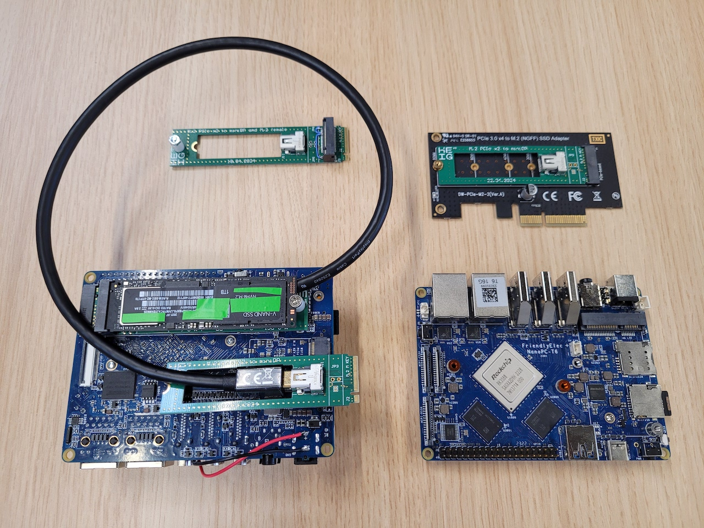
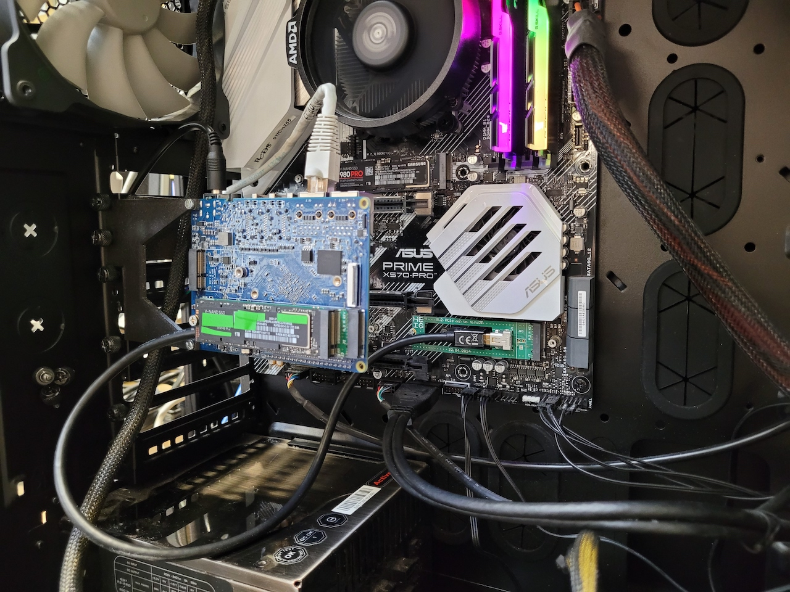

# *evil* Non Volatile Memory express - eNVMe

This project allows to create NVMe devices with extra capabilities in order to explore the security implications of an *evil* NVMe device.

Read more about eNVMe in our [**Paper:** Pandora's Box in Your SSD: The Untold Dangers of NVMe](https://arxiv.org/abs/2411.00439) - [(PDF)](https://arxiv.org/pdf/2411.00439)

---

A FriendlyElec NanoPC-T6 board modified to act as an NVMe drive :



It is recognized by the host computer as a normal NVMe drive, we can see the PC has both a commercial NVMe SSD and our *eNVMe* :


Picture of the *eNVMe* mounted inside a PC alongside a commercial NVMe SSD.



The main contributions of this projects are :

- A low-cost and fully open-source platform to explore the security implications of *evil* NVMe devices.
- Demonstrations that many systems today are vulnerable to storage-specific attacks.
- A number of reproducible attacks.
- Storage-specific attacks demonstrating that, even if a target computer is properly configured and protected against traditional DMA attacks (IOMMU), it is still vulnerable from its internal storage.

## Functionalities

The NVMe functionality is implemented as a Linux PCI endpoint function driver.
The [Linux PCI endpoint framework](https://www.kernel.org/doc/html/latest/PCI/endpoint/index.html) allows to implement PCIe endpoint functions (PCIe devices) based on Linux and drivers for the PCIe controllers in endpoint mode (as opposed to Root Complex mode). Endpoint mode: you are the device (e.g., NVMe drive), Root Complex mode: you are the host, devices get plugged into you. Some PCIe controllers allow to function in both modes.

### eNVMe Capabilities

- Read/Write PCI space from inside the NVMe firmware code
- Read/Write PCI space from user space inside the platform
  - Compatible with PCILeech https://github.com/ufrisk/pcileech
- Read/Write file systems stored on the *eNVMe*
- Remote activation through specific write patterns
- Provide altered data upon specific reads or read patterns
- AI based image / document identification
- Host shutdown window detection
- Full Linux user space
- And more...

Perform attacks through PCI DMA, Interrupt vectors, NVMe command processing, file systems, etc.

## Requirements

In order to run the eNVMe project you will need :

- A platform board, compatible boards below :
  - [FriendlyElec NanoPC T6](https://www.friendlyelec.com/index.php?route=product/product&product_id=292)
  - [FriendlyElec CM3588 + NAS Kit](https://www.friendlyelec.com/index.php?route=product/product&product_id=294) or [CM3588+](https://www.friendlyelec.com/index.php?route=product/product&product_id=299)
  - There are other boards that can be used but it requires porting the project
    - [Examples](https://github.com/rick-heig/nvme_csd/tree/main/platforms) are given in the NVMe Computational Storage Drive (CSD) sister project
- A micro SD card (at least 8 GB)
- An UART Adapter (to get a serial console), the board can be used via SSH as well
- PCIe cables to connect to the host PC
  - The cheapest route is an [M.2 adapter](https://www.aliexpress.com/item/1005003495492506.html), [PCIe x1 adapter and USB3 cable](https://www.aliexpress.com/item/10000349570647.html) or [M.2 adapter](https://www.aliexpress.com/item/1005003495492506.html) and USB3 cable. This will provide a x1 PCIe link
  - For a x4 PCIe link, only available with the T6 board, you need a [M.2 x4 to PCIe x4](https://www.delock.com/produkt/62584/merkmale.html) or [x16 adapter](https://www.delock.com/produkt/64133/merkmale.html?f=s) and [PCIe x4 **signal swap** male-to-male cable](http://www.adtlink.cn/en/product/R22SS.html)
  - Alternatively you could use M.2 to oculink (please check signal swap yourself)
  - Or [build](https://github.com/rick-heig/nvme_csd/tree/main/pcb) your own adapters

## Further information

### Getting started

The easiest way to get started is to download the prebuilt image on the [release page](https://github.com/rick-heig/eNVMe/releases/) and write it to an SD card (instructions on release page).

The SD card image is ready to use for the [FriendlyElec CM3588 + NAS Kit](https://www.friendlyelec.com/index.php?route=product/product&product_id=294) which we recommend, if you are using the [FriendlyElec NanoPC T6](https://www.friendlyelec.com/index.php?route=product/product&product_id=292), replace the `/boot/extlinux/extlinux.conf` file by `/boot/extlinux/extlinux.conf.t6`. For example:

```shell
# Suppose the rootfs of the SD is mounted in /media/<user>/rootfs
sudo mv /media/<user>/rootfs/boot/exlinux/extlinux.conf.t6 /media/<user>/rootfs/boot/extlinux/extlinux.conf
```

Once ready, insert SD card in board and turn it on, connect through UART or SSH and launch the eNVMe firmware with:

```shell
# Start without backing storage (will read 0's)
sudo nvme-epf --model "I am a null block disk" start
# Start with backing storage (example with /dev/nvme0n1)
sudo nvme-epf --model "Trust me 980 pro" --loop /dev/nvme0n1 start
```

The `--loop` option allows to choose the backing storage, for example an NVMe SSD, if you are on the CM3588 and have one installed. For more information on the firmware and launching see [firmware/README.md](firmware/README.md).

### Going further

Board setup instructions to setup from scratch are provided [here](doc/platform.md)

Firmware (Linux driver for the eNVMe endpoint function) information, capabilities, development information can be found [here](firmware)

As this project shares many aspects with out NVMe computational storage project https://github.com/rick-heig/nvme_csd, feel free to check it out.

### Known issues

- The current prebuilt SD card image doesn't have USB support on the T6, and on the CM3588 only the bottom USB3 is working.
  To fix this requires some changes in the associated device tree and there may be an issue with a driver.
- PCIe link instabilities
  Because the platform board was not built to be a PCIe endpoint (device) but rather a root complex (host), the board has its own PCIe clock generated on the PCB, clock that goes to the SoC and the M.2 edge connector for a potential device. Therefore this board cannot receive a clock from the host PC and has no other choice than to operate in [separate reference clock architecture](https://www.ti.com/lit/an/snaa386/snaa386.pdf), up to 600 ppm (parts per million) difference in the (100MHz) clocks is allowed.
  When the clock difference is too big, or the link is bad (e.g., noise, bad cables and adapters), the following can happen:
    - Link disconnects / reconnects (will be shown in dmesg as Link DOWN/UP)
    - PCIe DMA timeouts, once this happens the DMA will not operate anymore until a reboot
    - (Very) slow PCIe link

  This is very dependent on the host PC motherboard and CPU. We observed that relying on a PCIe switch which generates its own clock worked well. For example [PLX PEX8747](https://www.broadcom.com/products/pcie-switches-retimers/pcie-switches/pex8747) switches as in this [NVMe RAID Controller](https://www.highpoint-tech.com/product-page/ssd7101a-1).

  If this happens you can try setting the PCIe link to gen. 2 (PCIe 2.0) in the motherboard BIOS. The PCIe speed could also be changed in the device tree (overlay) used on the embedded platform. On the prebuilt SD card image in `/boot/` there are the files `rk3588-friendlyelec-cm3588-nas-ep-pcie2.dtbo` and `rk3588-nanopc-t6-pcie-ep-pcie2.dtbo` which can be selected in `/boot/extlinux/extlinux.conf` to limit the embedded controller to PCIe 2.0 speed.

  Maybe there is room for improvement in the Rockchip RK3588 PCIe controller IP or PHY Linux driver.