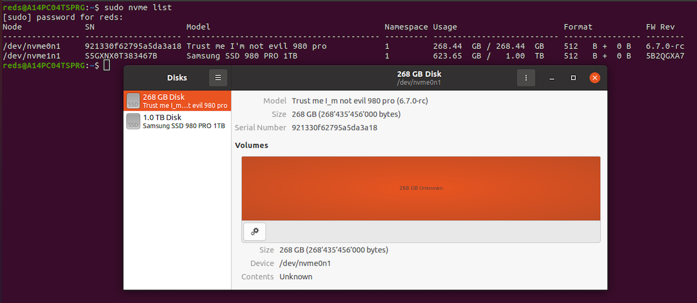

# *evil* Non Volatile Memory express - eNVMe

This project allows to create NVMe devices with extra capabilities in order to explore the security implications of an *evil* NVMe device.

A FriendlyElec NanoPC-T6 board modified to act as an NVMe drive :

It is recognized by the host computer as a normal NVMe drive, we can see the PC has both a commercial NVMe SSD and our *eNVMe* :

Picture of the *eNVMe* mounted inside a PC alongside a commercial NVMe SSD.

The main contributions of this projects are :

- A low-cost and fully open-source platform to explore the security implications of *evil* NVMe devices.
- Demonstrations that many systems today are vulnerable to storage-specific attacks.
- A number of reproducible attacks.
- Storage-specific attacks demonstrating that, even if a target computer is properly configured and protected against traditional DMA attacks (IOMMU), it is still vulnerable from its internal storage.

## Functionalities

The NVMe functionality is implemented as a Linux PCI endpoint function driver.
The [Linux PCI endpoint framework](https://www.kernel.org/doc/html/latest/PCI/endpoint/index.html) allows to implement PCIe endpoint functions (PCIe devices) based on Linux and drivers for the PCIe controllers in endpoint mode (as opposed to Root Complex mode). Endpoint mode: you are the device (e.g., NVMe drive), Root Complex mode: you are the host, devices get plugged into you. Some PCIe controllers allow to function in both modes.

### eNVMe Capabilities

- Read/Write PCI space from inside the NVMe firmware code
- Read/Write PCI space from user space inside the platform
  - Compatible with PCILeech https://github.com/ufrisk/pcileech
- Read/Write file systems stored on the *eNVMe*
- Remote activation through specific write patterns
- Provide altered data upon specific reads or read patterns
- AI based image / document identification
- Host shutdown window detection
- Full Linux user space
- And more...

Perform attacks through PCI DMA, Interrupt vectors, NVMe command processing, file systems, etc.

## Requirements

In order to run the eNVMe project you will need :

- A platform board, compatible boards below :
  - [FriendlyElec NanoPC T6](https://www.friendlyelec.com/index.php?route=product/product&product_id=292)
  - [FriendlyElec CM3588 + NAS Kit](https://www.friendlyelec.com/index.php?route=product/product&product_id=294) or [CM3588+](https://www.friendlyelec.com/index.php?route=product/product&product_id=299)
  - There are other boards that can be used but it requires porting the project
    - [Examples](https://github.com/rick-heig/nvme_csd/tree/main/platforms) are given in the NVMe Computational Storage Drive (CSD) sister project
- A micro SD card (at least 8 GB)
- An UART Adapter (to get a serial console), the board can be used via SSH as well
- PCIe cables to connect to the host PC
  - The cheapest route is an [M.2 adapter](https://www.aliexpress.com/item/1005003495492506.html), [PCIe x1 adapter and USB3 cable](https://www.aliexpress.com/item/10000349570647.html) or [M.2 adapter](https://www.aliexpress.com/item/1005003495492506.html) and USB3 cable. This will provide a x1 PCIe link
  - For a x4 PCIe link, only available with the T6 board, you need a [M.2 x4 to PCIe x4](https://www.delock.com/produkt/62584/merkmale.html) or [x16 adapter](https://www.delock.com/produkt/64133/merkmale.html?f=s) and [PCIe x4 **signal swap** male-to-male cable](http://www.adtlink.cn/en/product/R22SS.html)
  - Alternatively you could use M.2 to oculink (please check signal swap yourself)
  - Or [build](https://github.com/rick-heig/nvme_csd/tree/main/pcb) your own adapters

## Further information

Board setup instructions are provided [here](doc/platform.md)

Firmware (Linux driver for the eNVMe endpoint function) information, capabilities, development information can be found [here](firmware)

